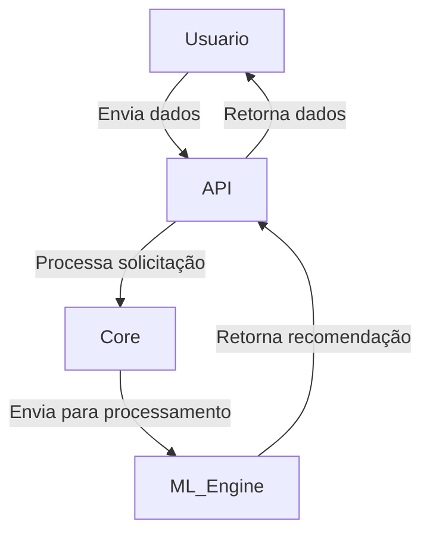
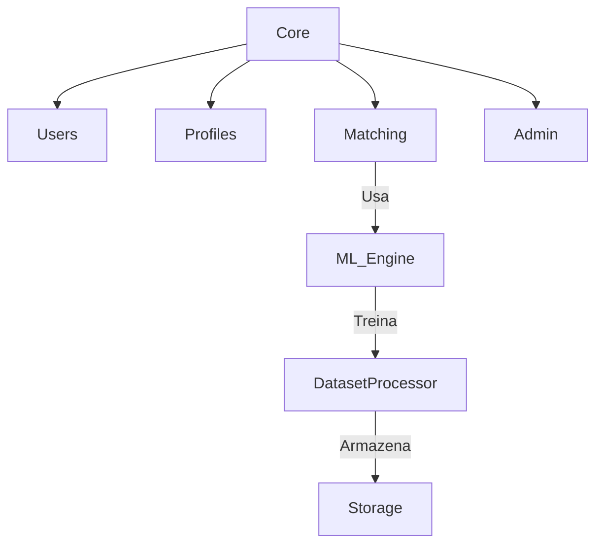
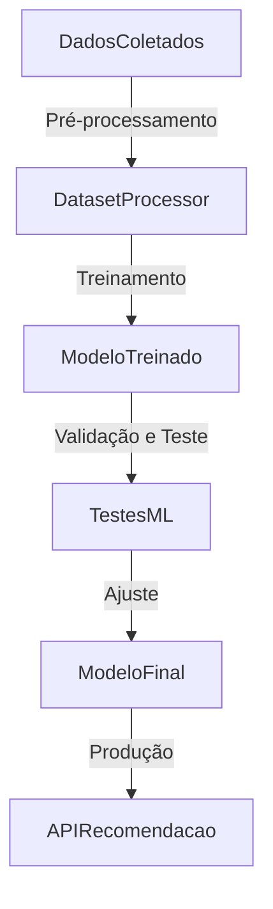

# Arquitetura do Sistema

## **Visão Geral**
O **TenisMatch** é um sistema baseado em Django que utiliza **Machine Learning** para analisar preferências de calçados e sugerir compatibilidades entre usuários. A arquitetura do sistema segue um modelo modular e escalável, permitindo futuras expansões e ajustes dinâmicos com base em feedback e aprendizado contínuo.

## **Fluxo de Requisições**


1. **Usuário interage com a aplicação**, fornecendo dados de preferências.
2. **API recebe e processa a solicitação**.
3. **Módulo Core** gerencia a lógica e direciona para o **ML_Engine**.
4. **ML_Engine processa as informações**, realiza inferências e retorna sugestões.
5. **API envia a recomendação final ao usuário**.

## **Diagrama de Dependências**


## **Estrutura de Diretórios**
```plaintext
tenismatch/
│── apps/
│   ├── users/  # Gerenciamento de usuários e autenticação
│   ├── matching/  # Algoritmo de recomendação
│   ├── profiles/  # Preferências e informações do usuário
│   ├── admin/  # Painel administrativo
│── core/  # Configurações principais
│── static/  # Arquivos estáticos
│── templates/  # Interface HTML
│── tests/  # Testes automatizados
│── docs/  # Documentação do sistema
│── scripts/  # Scripts utilitários para manutenção
│── manage.py
│── requirements.txt
```

## **Banco de Dados**
- **Banco de Dados:** SQLite
- **Principais tabelas:**
  - `users`: Informações de autenticação e perfil
  - `profiles`: Preferências e características do usuário
  - `matches`: Registros das recomendações geradas pelo sistema
  - `datasets`: Armazena informações usadas para treinamento do modelo
  - `ml_models`: Histórico dos modelos de machine learning treinados
  - `feedback`: Armazena avaliações dos usuários sobre as recomendações recebidas

## **Pipeline de Machine Learning**

- **Pré-processamento:** Limpeza e normalização dos dados
- **Treinamento:** Aplicação de RandomForestClassifier e otimização
- **Validação e Teste:** Métricas como precisão e recall para avaliação
- **Ajuste e Produção:** Aperfeiçoamento contínuo com base em feedback

## **Aplicações do Sistema**
- **API Restful**: Fornece comunicação entre os módulos e usuários.
- **Sistema de Recomendação**: Processa preferências e sugere compatibilidades.
- **Admin Panel**: Interface para gerenciar dados, usuários e modelos treinados.
- **Sistema de Autenticação**: Controle de usuários e permissões via Django Auth.
- **Módulo de Feedback**: Coleta avaliações dos usuários para aprimorar recomendações.

## **Módulos Principais**
- **Core**: Configuração do Django, middlewares, autenticação global.
- **Users**: Registro, login, gerenciamento de permissões.
- **Profiles**: Informações detalhadas do usuário e preferências.
- **Matching**: Algoritmo de recomendação baseado em Machine Learning.
- **Admin**: Interface administrativa e painéis de controle.
- **DatasetProcessor**: Responsável pelo processamento e estruturação dos dados.
- **ML_Engine**: Módulo que realiza o treinamento, ajuste e inferência dos modelos.
- **API**: Controla as requisições e processa respostas.
- **Feedback**: Armazena avaliações dos usuários para otimizar recomendações futuras.

## **Tecnologias Utilizadas**
- **Django e Django Rest Framework** para APIs e backend.
- **SQLite** como banco de dados padrão.
- **Scikit-learn** para aprendizado de máquina.
- **Joblib** para armazenamento e carregamento de modelos treinados.
- **Gunicorn** para servir a aplicação em produção.
- **Matplotlib e Seaborn** para visualização de dados.
- **Celery e Redis (opcional)** para processamento assíncrono futuro.

## **Próximos Passos**
- Implementação de cache para otimizar consultas recorrentes.
- Otimização do tempo de resposta do algoritmo de recomendação.
- Expansão do dataset para melhorar a precisão dos modelos.
- Melhorias na documentação e automação de testes.
- Integração com APIs externas para validação de preferências de calçados.

---
Essa documentação será atualizada conforme novas implementações forem realizadas.

