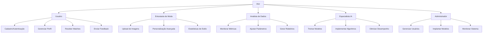
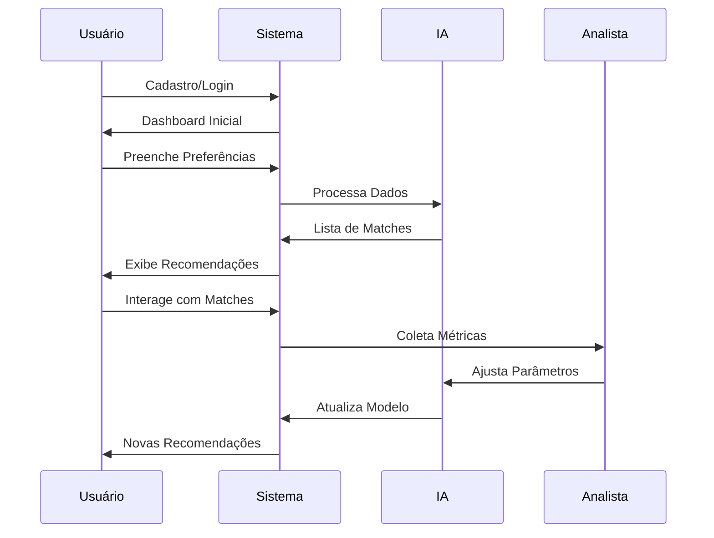

# Funcionalidades por Ator - TenisMatch

## Detalhamento por Ator

### 1. Usuário Base
**Arquivos Relacionados:**
- `apps/users/views.py` (Autenticação)
- `templates/profiles/edit.html` (Perfil)
- `apps/matching/views.py` (Matches)

**Funcionalidades:**
- Cadastro/Autenticação (Signup/Login)
- Edição de perfil e preferências básicas
- Visualização de matches sugeridos
- Interação com outros usuários (Like/Dislike)
- Envio de feedback sobre recomendações

### 2. Entusiasta de Moda
**Arquivos Relacionados:**
- `apps/profiles/forms.py` (Upload de imagens)
- `templates/profiles/detail.html` (Visualização estilo)

**Funcionalidades:**
- Upload de fotos de calçados/estilo
- Análise visual de compatibilidade
- Personalização avançada de preferências
- Acesso a estatísticas de estilo pessoal
- Comparação com tendências de mercado

### 3. Analista de Dados
**Arquivos Relacionados:**
- `apps/tenis_admin/services/metrics_service.py`
- `templates/manager/metrics_dashboard.html`

**Funcionalidades:**
- Monitoramento de KPIs de recomendação
- Ajuste manual de pesos do algoritmo
- Geração de relatórios de desempenho
- Análise de padrões de comportamento
- Validação de conjuntos de dados

### 4. Especialista em IA
**Arquivos Relacionados:**
- `apps/tenis_admin/services/model_training_service.py`
- `apps/matching/ml/training.py`

**Funcionalidades:**
- Treinamento de novos modelos
- Ajuste de hiperparâmetros
- Implementação de novos algoritmos
- Validação de desempenho do modelo
- Otimização de consumo de recursos

### 5. Administrador
**Arquivos Relacionados:**
- `apps/tenis_admin/views.py`
- `apps/tenis_admin/services/model_deployment_service.py`

**Funcionalidades:**
- Gerenciamento de usuários e permissões
- Implantação de modelos em produção
- Monitoramento da infraestrutura
- Configuração de parâmetros globais
- Gerenciamento de atualizações

## Fluxo de Interação

**Arquivo gerado com base em:**
- `memory-bank/projectbrief.md`
- `memory-bank/productContext.md`
- `docs/plano_correcoes.md`
- Análise da estrutura de diretórios
