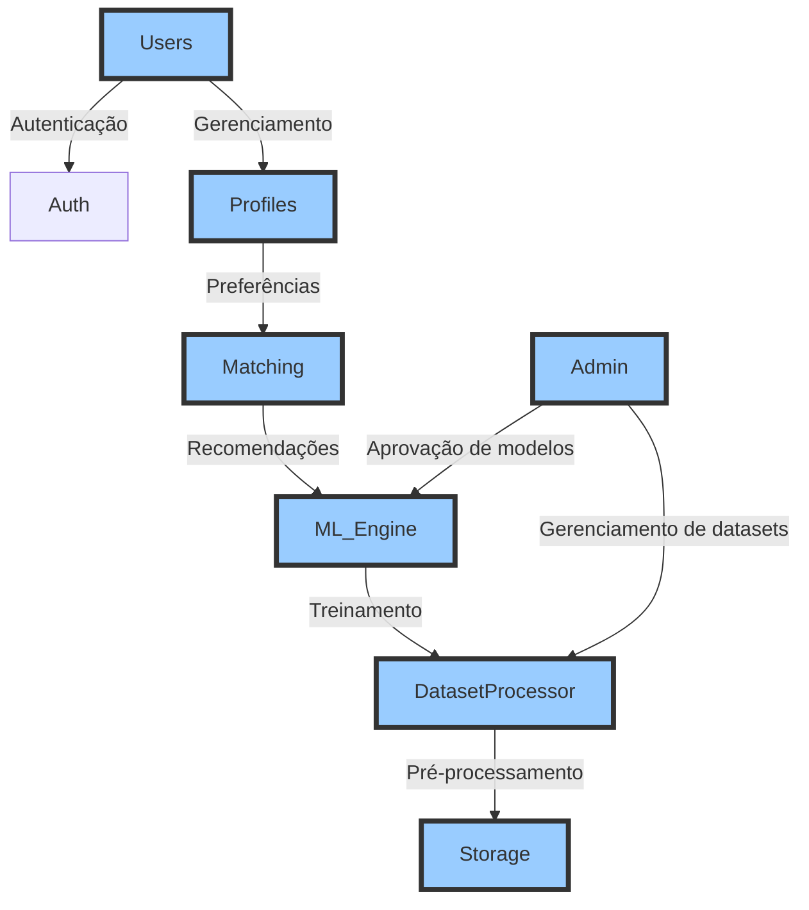

# System Patterns

## Arquitetura Geral
- **Django** como framework principal
- Aplicações modulares (**apps/**) organizadas por responsabilidade:
  - **Core** (configurações principais)
  - **Matching** (sistema de recomendações com Machine Learning)
  - **Profiles** (gestão de perfis e preferências)
  - **Admin** (painel de administração e dashboards analíticos)
  - **Users** (autenticação, permissões e controle de acesso RBAC)

## Fluxo de Chamadas do Sistema

## Padrões de Design
- **Service Layer (services/)**
  - **DataProcessor**: tratamento e limpeza de datasets
  - **Recommender**: lógica de recomendação baseada em padrões de calçados
  - **TrainingService**: pipeline de treinamento e ajuste do modelo de IA
- **Model-View-Template (MVT)** para estruturação do Django
- **Repository Pattern** para acesso desacoplado aos dados
- **Observer Pattern** via signals para ações automatizadas

## Fluxos Principais
1. **Coleta e processamento de dados**: extração de preferências e análise de padrões
2. **Treinamento de modelos de IA**: aprendizado supervisionado para ajustes na recomendação
3. **Geração de recomendações personalizadas**: sugestões baseadas em comportamento e preferências
4. **Interação e feedback do usuário**: ajustes automáticos no modelo com base nas respostas
5. **Aprimoramento contínuo do sistema**: ajustes dinâmicos e otimização do algoritmo de recomendação

O sistema é projetado para **evoluir continuamente com os dados coletados**, garantindo **melhores recomendações e experiências mais personalizadas para os usuários**.

