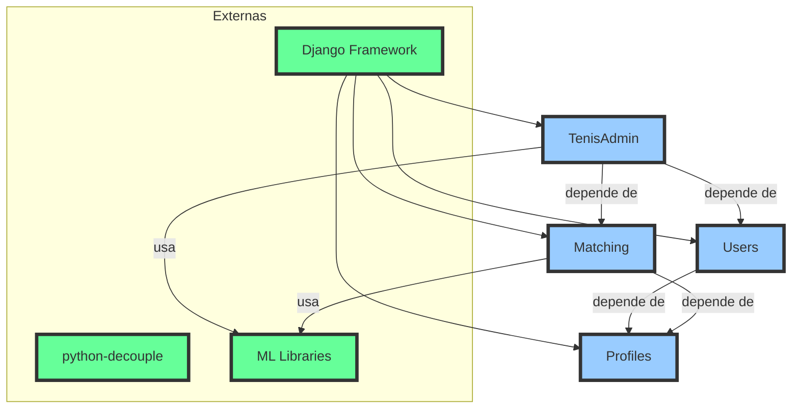

# Tech Context

## Stack Principal
- **Django (Python)** como framework backend
- **SQLite** como banco de dados principal
- **Scikit-learn** para aprendizado de máquina
- **Pandas** para processamento e análise de dados
- **Joblib** para armazenamento e carregamento de modelos treinados

## Dependências Chave
- **Django REST Framework** (APIs e autenticação)
- **Django Allauth** (gestão de usuários e autenticação social)
- **Django Crispy Forms** (formulários responsivos)
- **Whitenoise** (servidor de arquivos estáticos)
- **Gunicorn** para servir a aplicação em produção
- **Python-decouple** para gerenciamento de configurações

## Arquitetura de Dependências


## Pipeline de Machine Learning
O modelo de recomendação do **TenisMatch** utiliza um **RandomForestClassifier**, responsável por processar e avaliar compatibilidades entre usuários com base em preferências de calçados e comportamento registrado.

### **Treinamento e Avaliação**
```python
from sklearn.ensemble import RandomForestClassifier
from sklearn.model_selection import train_test_split
from sklearn.metrics import accuracy_score, classification_report
import joblib

class ModelTraining:
    def __init__(self):
        self.model = RandomForestClassifier(
            n_estimators=100,
            max_depth=10,
            random_state=42
        )

    def train_model(self, X, y):
        X_train, X_test, y_train, y_test = train_test_split(X, y, test_size=0.2, random_state=42)
        self.model.fit(X_train, y_train)
        y_pred = self.model.predict(X_test)
        return accuracy_score(y_test, y_pred), classification_report(y_test, y_pred)
```

### **Armazenamento e Reuso de Modelos**
```python
def save_model(self, filename='tenis_match_model.joblib'):
    joblib.dump(self.model, filename)

def load_model(self, filename='tenis_match_model.joblib'):
    self.model = joblib.load(filename)
    return self.model
```

## Configurações Importantes
- **Otimização de consultas e caching interno** para melhor performance
- **Configuração modular** para adaptação entre desenvolvimento e produção
- **Monitoramento e ajuste dinâmico do modelo de IA**
- **Possível integração futura** com modelos de deep learning para aprimoramento das recomendações

## Requisitos de Sistema
- **Python 3.10+**

O **TenisMatch** foi projetado para ser **eficiente e escalável**, garantindo um ambiente otimizado para análises e recomendações personalizadas.

